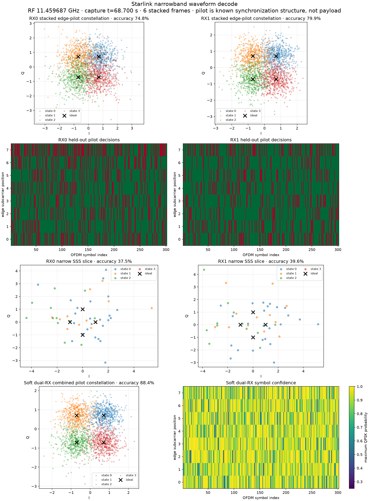
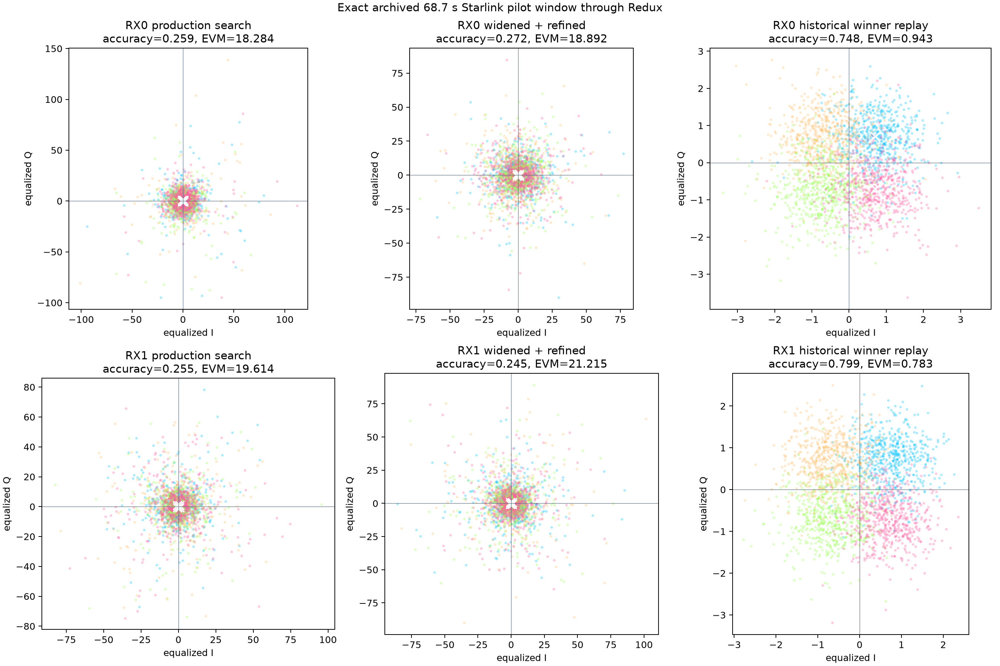
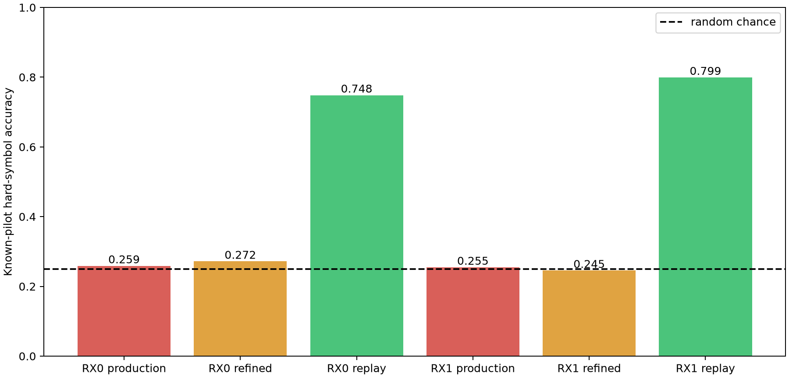

# Retrospective QAM investigation: 2026-08-13 CH4 lower-edge capture

## Outcome

The strong pilot constellation in the historical `leo-tracker` report is real
and reproducible from retained raw IQ.  The native Redux QAM demodulator matches
the oracle metrics at floating-point precision when it is given the historical
timing/CFO acquisition result.  The deployed Redux acquisition search does not
find that result: it selects an alias with chance-level QAM.

This localizes the failure before constellation demodulation.  The immediate
problem is acquisition coverage and winner selection, not the Qin pilot code,
the raw recording, or the QAM equalizer.

The historical result is candidate evidence for the known published Starlink
edge-pilot synchronization sequence.  It is not payload demodulation and the
selected observation was not a calibrated detection (`candidate=true`,
`qualified=false`).

## Source and provenance

- Historical page:
  `http://satpi01:8765/recordings/beacon/ch4-lower-edge-narrow-pluto-5d4d-20260813T211014Z`
- Oracle repository revision:
  `0bb80d14759fd8496b74e7d3219a690be18565a6`
- Historical decode JSON SHA-256:
  `4fb035977fa7f124176449ff8ca72200edd2c95a61b629e56ff2ab8f64eb163b`
- Historical follow-up JSON SHA-256:
  `89b901207ed6e3c3dbde531d6dc60b9b0a498677065e51c8cbe6fa71a3b37002`
- Retained raw-IQ clip:
  `/mnt/qnap01/mouse9911/leo-cropped/evidence-v2/ch4-lower-edge-narrow-pluto-5d4d-20260813T211014Z/clip-002.ci16`
- Raw-IQ clip SHA-256:
  `6d105ae645c0ac91e0e93ebc4ac5b456890025ebfb9bb9e1344423dc27c7c3fa`
- Clip geometry: little-endian CI16, layout
  `sample,receiver,component`, two receivers, 62,525,000 samples, 2.5 MS/s,
  original capture interval 53.5–78.51 s.
- Replayed observation: original capture time 68.7–68.71 s, CH4 lower edge,
  IF 1.7096875 GHz / RF 11.4596875 GHz.

The original 2.4 GB capture object had been reclaimed.  Its evidence bundle
retains this independently checksummed 500,200,000-byte clip specifically for
decoded symbols, exact candidates, and the continuous Doppler track.  The
68.7-second observation lies 15.2 seconds into that clip.

## Historical evidence

| Metric | RX0 | RX1 | Soft dual-RX combination |
|---|---:|---:|---:|
| Epoch within 10 ms window | 2,063 samples | 2,063 samples | — |
| Carrier offset | +364,150.848 Hz | −194,343.874 Hz | — |
| Exact / roll-17 control score | 0.356175 / 0.014084 | 0.385697 / 0.015197 | — |
| Exact-control margin | 0.342091 | 0.370500 | — |
| Complete frames | 6 | 6 | 6 |
| Pilot hard-symbol accuracy | 74.8333% | 79.9167% | 88.3750% |
| RMS EVM | 0.942549 | 0.782622 | 0.638002 |
| Soft confidence | 73.62% | 79.25% | 89.36% |

The individual receivers already show substantial four-state separation; the
dual-RX inverse-noise combination improves it further.



## Redux replay

The script [qam_retro_analysis.py](qam_retro_analysis.py) reads the retained IQ
directly and invokes only native Redux detector and constellation components.
`leo-tracker` is used as an offline numerical oracle, never as a runtime
dependency.

### Production search

Redux currently analyzes the first 20,000 samples (8 ms) of the selected
window.  Its production acquisition grid uses epochs spaced by 64 samples and
coarse CFO hypotheses from −100 to +100 kHz in 20 kHz steps.

| Metric | RX0 | RX1 |
|---|---:|---:|
| Production winning epoch | 64 | 1,984 |
| Production winning CFO | −40 kHz | −80 kHz |
| Production search / control | 0.045142 / 0.024265 | 0.041973 / 0.015466 |
| QAM accuracy | 25.875% | 25.458% |
| RMS EVM | 18.284 | 19.614 |

Both results are effectively chance-level four-state decisions.  RX0's true
CFO is completely outside the production range.  RX1's true CFO is also
outside it, despite being closer.  The true epoch 2,063 is not on the 64-sample
grid.

### Naive wider/local search

Widening the same full-frame objective to ±400 kHz and locally refining only
its single best coarse cell did not recover the signal.  It continued to select
aliases:

| Metric | RX0 | RX1 |
|---|---:|---:|
| Widened coarse winner | epoch 64, −40 kHz | epoch 2,048, +200 kHz |
| Local refined winner | epoch 84, −60 kHz | epoch 2,040, +193 kHz |
| Refined QAM accuracy | 27.167% | 24.542% |

This rules out “just widen the CFO tuple” as a sufficient fix.  The current
full-frame objective has competing timing/CFO aliases, and refining only its
rank-1 coarse winner preserves the wrong basin.

### Historical-winner replay through native Redux

For the decisive test, the same retained 25,000 samples and exact historical
epoch/CFO were passed to the native Redux constellation analyzer.  Redux
reproduced both individual-RX oracle results:

| Metric | RX0 oracle | RX0 Redux | RX1 oracle | RX1 Redux |
|---|---:|---:|---:|---:|
| Complete frames | 6 | 6 | 6 | 6 |
| Pilot accuracy | 74.833333% | 74.833333% | 79.916667% | 79.916667% |
| RMS EVM | 0.9425486 | 0.9425485 | 0.7826223 | 0.7826224 |
| Residual CFO | −5.8493 Hz | −5.8492 Hz | −1.2784 Hz | −1.2784 Hz |





## Root cause and implications

1. **The QAM kernel is correct.** Given the correct epoch/CFO and the same six
   frames, Redux matches `leo-tracker` essentially exactly.
2. **The production CFO domain is insufficient.** The historical offsets are
   +364 kHz and −194 kHz, while production searches only ±100 kHz.
3. **The production epoch grid is too coarse for final demodulation.** A
   64-sample step permits a 32-sample (12.8 µs) error, nearly three 4.4-µs OFDM
   symbols.
4. **The current rank-1 acquisition objective is alias-prone.** A broad CFO
   grid plus a local search around only its best coarse cell still chose the
   wrong basin on both receivers.
5. **The historical pipeline used stronger acquisition.** It used a
   pilot-symbol epoch search, a receiver-specific wide CFO search, fine CFO
   refinement, and a selected 10 ms window elsewhere in the dwell.  Redux
   production currently conditions QAM on one 8 ms suite winner.

## Recommended fix and acceptance tests

Implement a bounded, native two-stage acquisition revision rather than merely
changing the CFO limits:

1. Search a receiver/LNB-aware physical CFO range covering at least ±400 kHz.
2. Retain multiple separated coarse timing/CFO candidates, not only rank 1.
3. Refine each retained candidate at sample-level timing and fine CFO spacing
   using held-out pilot symbols; select only after refinement.
4. Run the search over stratified temporal windows across the dwell, preserving
   the exact time look-elsewhere scope for Qin and every precommitted surrogate.
5. Keep individual-radio/RX evidence.  Add dual-RX combination only as an
   additional view with exact provenance, never as a replacement.
6. Recalibrate null distributions over the entire revised time/epoch/CFO search
   because the maximum-statistic search space has changed.

Required tests:

- Synthetic matrix across every epoch residue modulo 64 and CFOs from −400 to
  +400 kHz, including both signs and boundary values.
- Recover the correct basin and greater than 90% pilot accuracy for clean
  injected Qin signals.
- This archived 68.7-second regression must recover both historical receivers
  and match the oracle accuracy/EVM within a declared numerical tolerance.
- Noise, stationary interferer, wrong-pattern, and time-shuffled controls must
  remain explicit and use the identical candidate search.
- A multi-peak test must prove a strong alias cannot hide a weaker correct
  candidate before sample-level/held-out adjudication.
- Resource and cancellation bounds must be frozen before deployment.

## Reproduction

```bash
uv run --with matplotlib python reports/qam_retro_analysis.py \
  --clip /mnt/qnap01/mouse9911/leo-cropped/evidence-v2/ch4-lower-edge-narrow-pluto-5d4d-20260813T211014Z/clip-002.ci16 \
  --historical-json /mnt/qnap01/mouse9911/leo/reports/decoded/ch4-lower-edge-narrow-pluto-5d4d-20260813T211014Z.json \
  --output-directory reports/qam_retro_assets
```

Machine-readable results are in
[results.json](qam_retro_assets/results.json).  The reproducer initially
normalizes CI16 samples to the same `complex64` representation used by the
production recording reader.

