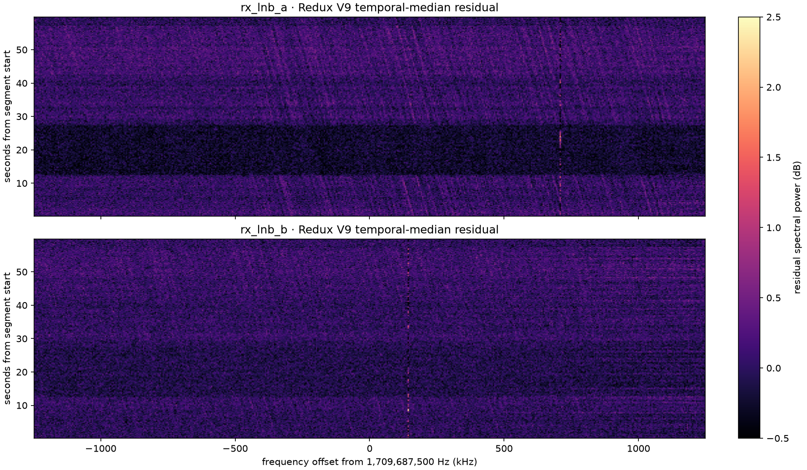
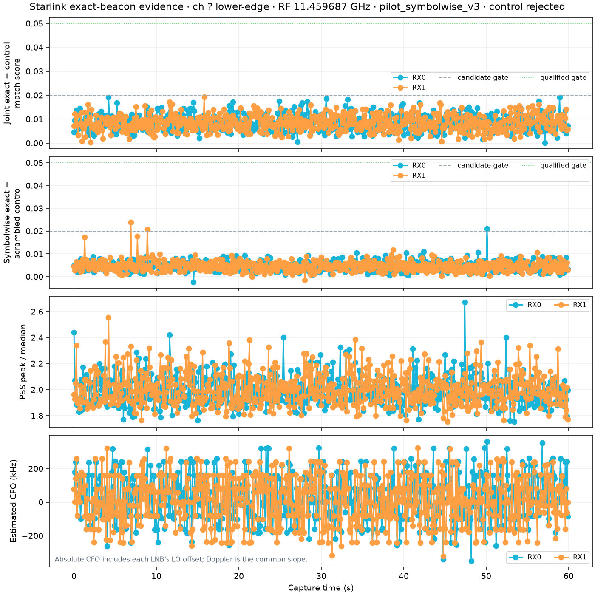
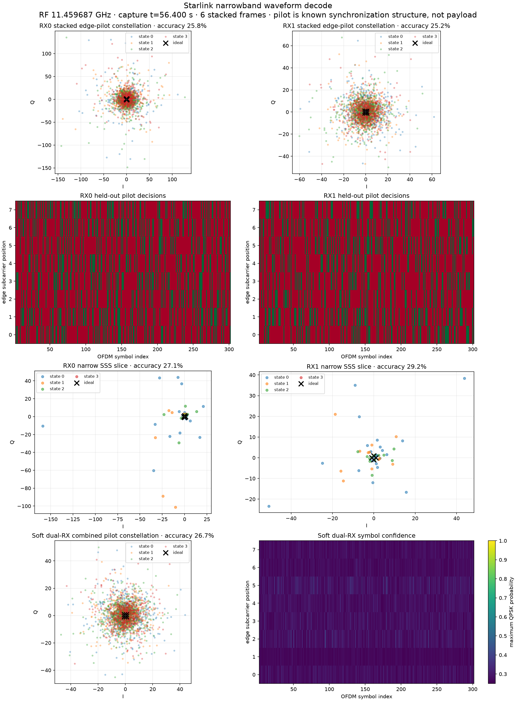

# `rec_01M098ZRCXEER4HHRX0YVFFTJ9`: historical `leo-tracker` signal investigation

Date: 2026-08-18 UTC  
Live page: <http://gauss:8090/recordings/rec_01M098ZRCXEER4HHRX0YVFFTJ9>

## Conclusion

This recording contains narrow, intermittent spectral excess at approximately
`+710.411 kHz` on `rx_lnb_a` and `+144.005 kHz` on `rx_lnb_b`. The separation,
`566.406 kHz`, is only about `1.0 kHz` from the historical `pluto-5d4d`
receiver-centre differential (`567.402 kHz`). That makes the pair worth retaining
as **candidate RF evidence**.

It is not, however, a calibrated Starlink pilot detection. A dense replay with
the historical `pilot_symbolwise_v3` detector checked 600 ten-millisecond windows
(one every 100 ms, 10% exact temporal coverage) on both receivers and produced:

| Historical result | RX0 / `lnb-a` | RX1 / `lnb-b` | Joint |
|---|---:|---:|---:|
| Exact checks | 600 | 600 | 600 paired |
| Single-receiver candidates | 0 | 0 | — |
| Candidate / qualified windows | — | — | **0 / 0** |
| Match-margin median / p95 / max | 0.008392 / 0.014281 / 0.019139 | 0.008246 / 0.014187 / 0.019235 | candidate gate 0.020 dual, 0.025 single |
| Symbol-margin median / p95 / max | 0.004667 / 0.008177 / 0.020987 | 0.004525 / 0.008093 / 0.023756 | candidate gate 0.020 dual, 0.030 single |
| Pilot-coherence median / p95 / max | 0.020665 / 0.042570 / 0.063235 | 0.020752 / 0.042950 / 0.061643 | qualified gate 0.050 |

The strongest forced paired QAM diagnostic is also null-like: individual pilot
symbol accuracy is 25.8% and 25.2%, and inverse-noise dual-RX accuracy is 26.7%
against a 25% random-QPSK baseline. The combined soft expected-symbol probability
is 0.2513 and entropy is 1.9918 bits (the random four-state limit is 2 bits).
There is no separated QAM constellation.

The safest interpretation is therefore: **intermittent narrowband structure is
visible, but this recording does not reproduce the strong Starlink pilot/QAM
evidence from the historical positive example.** The Redux advanced Doppler paths
must remain candidate-only for this recording.

## Authoritative source and capture provenance

The recording was resolved from Redux's public catalog projection and immutable
CAS object references. No storage paths were inferred from a recording ID, and no
database, radio, service, or CAS object was modified.

| Field | Value |
|---|---|
| Recording state | `published`; analysis dashboard state `complete` |
| Capture UTC | `2026-08-18T01:50:14.434193677Z` to `2026-08-18T01:51:14.640810886Z` |
| Radio | `radio_pluto_5d4d`; serial `1040005e0b100007100010000bf33a5d4d` |
| Hardware snapshot | `hw_gauss_r20_science_postreboot_20260816_v1` |
| Segment | `seg_plan_focused_loop_00000004_18ccc3317a001781_a_ch4_lower` |
| Receiver chains | `rx_lnb_a`, `rx_lnb_b` |
| Tuning | CH4 lower, IF centre `1,709,687,500 Hz`, RF pilot centre `11,459,687,500 Hz` |
| Sampling | CI16 LE, `(sample, receiver, component)`, 2.5 Msps, 150,000,000 samples/receiver, 60 s |
| Data object | 1,200,000,000 bytes; SHA-256 `9103856338da895d7498a23e0f027806dd1b11cd86e43510742e8cd20a039f91` |
| Metadata object | SHA-256 `4343c36da89d409ee032084a6ce0c246132d1dfd6e6024b81777f5eda0f04264` |
| Recording manifest | SHA-256 `7ad2c4150acfe989fbaa5237413412749d75d8e85f59ca98c68cc101647619ee` |
| Continuity | 1,500 refills, no gaps; maximum recorded timing uncertainty 1,275,521 ns |
| AGC telemetry | RX0 gain 67 throughout, raw RSSI field median 90.75; RX1 gain 69, raw RSSI median 92.75 |

The raw RSSI values above are reported exactly as stored; this investigation does
not assume a sign or dBm calibration that the metadata contract does not declare.

Independent `sha256sum` of both CAS files matched their catalog digests. The
historical wrapper was a temporary manifest plus a symlink to the immutable data
object; it did not copy or rewrite the IQ.

## What is visible in the waterfall



The plotted values are Redux V9's temporal-median residual power, not absolute
PSD. The full dwell contributes 4,577 FFT frames per receiver (32,768 samples per
FFT) and 200 displayed time bins, covering 99.9861% of the contiguous samples.

| Residual feature | `rx_lnb_a` | `rx_lnb_b` |
|---|---:|---:|
| Strong-bin offset | +710.411 kHz | +144.005 kHz |
| Strong-bin maximum | 2.035 dB at 23.835 s | 2.689 dB at 8.539 s |
| Strong-bin p95 | 1.068 dB | 1.104 dB |
| Time-bin correlation at the two aligned frequencies | \- | **0.119** |
| Joint bins above 0.5 dB | \- | **13 / 200** |

The two frequency offsets have the right *static differential* for the two LNBs,
but their residual amplitudes correlate weakly. They appear as nearly vertical,
intermittent features rather than a clean common sloped ridge. The large broad
horizontal level changes near 12 s and 28 s are common display/background changes,
not Doppler tracks.

## Historical detector replay

Historical source was used only as a numerical oracle:

| Item | Provenance |
|---|---|
| Repository | `/home/mouse9911/gits/leo-tracker` |
| Commit | `0bb80d14759fd8496b74e7d3219a690be18565a6` |
| Working-tree caveat | Existing unrelated modifications were present; none was read as an input or changed by this investigation |
| Detector | `leo_tracker.radio.beacon.analysis`, `pilot_symbolwise_v3` |
| Pilot/code source | published 300-by-8 lower-edge 4QAM pilot matrix from `leo_tracker.radio.beacon.pilots` |
| Null | symbol-roll-17 conditioned control from the same historical detector |

The dense replay used the same timing as the historical follow-up path: a 10 ms
exact window every 100 ms. Unlike the old positive-example workflow, it applied
that cadence across the complete 60 s dwell instead of only ±0.5 s around
prescreen triggers. Coarse structure analysis additionally evaluated 60
non-overlapping one-second windows after decimation to 50 ksps; none qualified.



The first two panels show exact-minus-control margins. No paired point clears the
candidate gates. The final panel's CFO hypotheses jump over hundreds of kilohertz
rather than forming a coherent dual-receiver track. Because zero exact-pilot
candidates exist, the historical Doppler summary correctly reports `available:
false`, `point_count: 0`, and `qualified: false`.

Two sensitivity checks reached the same decision:

| Check | Exact cadence | Receiver search centres | Candidates / qualified |
|---|---:|---:|---:|
| Raw-zero replay | 2 s | 0 / 0 Hz | 0 / 0 of 30 |
| Historical R20 differential | 1 s | +567,402 / 0 Hz | 0 / 0 of 60 |
| Observed residual-bin centres | 1 s | +710,411 / +144,005 Hz | 0 / 0 of 60 |
| Dense primary replay | 0.1 s | 0 / 0 Hz | **0 / 0 of 600** |

The observed-bin sensitivity run is diagnostic rather than calibrated: choosing a
frequency after inspecting the same dwell incurs selection bias. It is included
only to show that centring on the visible narrow lines does not recover pilot
structure.

## Forced QAM diagnostic

No QAM decode is statistically justified because there was no acquisition. To
test whether a visually compelling constellation was nevertheless being hidden,
the historical decoder was forced onto the strongest *paired* (still rejected)
10 ms hypothesis at 56.4 s. This is explicitly not a detection.



| Metric | RX0 | RX1 | Soft dual-RX |
|---|---:|---:|---:|
| Stacked frames | 6 | 6 | 6 |
| Pilot hard-symbol accuracy | 25.75% | 25.21% | 26.71% |
| Random-QPSK accuracy | 25% | 25% | 25% |
| Pilot model SNR | -29.97 dB | -28.10 dB | — |
| Soft expected-symbol probability | 0.2502 | 0.2510 | 0.2513 |
| Soft entropy | 1.9980 bits | 1.9938 bits | 1.9918 bits |

The colour classes overlap at the origin and decisions are essentially chance.
This is the expected appearance when the known QAM code is imposed on noise or an
unrelated carrier; it is unlike the separated historical positive constellation.

## Comparison with current Redux evidence

| Redux product | Live result | Interpretation |
|---|---|---|
| V9 Doppler visualization | `complete`, zero basic candidates, two advanced-path-only entries | Candidate evidence only |
| V9 advanced RX0 | drift `-250 Hz/s`; held-out 0.08081; opposite-slope 0.08559; stationary -0.00340 | Held-out score does not exceed the opposite-slope control |
| V9 advanced RX1 | drift `-4,750 Hz/s`; held-out 0.00321; opposite-slope -0.00059; stationary -0.02127 | Very small absolute separation; advanced path only |
| V19 advanced Doppler | `complete`, `candidate_only: true`, no calibrated count; RX0 exposed, 796 original adjacent-point windows, response truncated to 128 | Visualization/estimate, not a detection |
| V10 surrogate null | absent | No per-recording calibrated target/null conclusion available |
| V11/V17 QAM | absent | No current acquired constellation available |
| V15 full dwell | absent | No current full-dwell detector product available |

Redux labels this evidence correctly: `candidate-only-no-calibrated-detection` and
`advanced-path-only-not-a-calibrated-detection`. The old replay strengthens that
caution. In particular, RX0's held-out score (0.08081) is slightly *below* its
opposite-slope score (0.08559), and the historical known-code detector finds no
candidate epochs from which a Doppler track could be formed.

## Reproduction

The public, read-only API checks were:

```bash
curl -fsS http://gauss:8090/api/v3/recordings/rec_01M098ZRCXEER4HHRX0YVFFTJ9
curl -fsS http://gauss:8090/api/v9/recordings/rec_01M098ZRCXEER4HHRX0YVFFTJ9/doppler-visualization
curl -fsS 'http://gauss:8090/api/v19/recordings/rec_01M098ZRCXEER4HHRX0YVFFTJ9/evidence-advanced-doppler?maximum_windows=128'
```

The catalog lookup selected `recording_id`, data/metadata digest algorithms and
values, manifest digest, state, and publication timestamp from the public
`recording` table using the dashboard's `catalog-dsn` systemd credential and a
bound recording-ID parameter. The CAS was opened using the catalog-returned
digest and the `analysis-cas-root` credential.

Given a temporary historical-format manifest whose only chunk is the verified
CAS object, the primary oracle command was:

```bash
OPENBLAS_NUM_THREADS=1 OMP_NUM_THREADS=1 \
  /home/mouse9911/gits/leo-tracker/.venv/bin/leo-radio \
  starlink-beacon-analyze INPUT CAPTURE_REPORT.json \
  --window-s 1 --maximum-analysis-rate-hz 50000 \
  --exact-interval-s .1 --exact-window-s .01 \
  --exact-acquisition-method pilot_symbolwise_v3 \
  --exact-subband-rate-hz 2500000 \
  --receiver-center-offsets-hz 0 0 --plot PILOT_REPLAY.png
```

The QAM plot was generated only after preserving the selected check's
`candidate: false` and `qualified: false` flags:

```bash
/home/mouse9911/gits/leo-tracker/.venv/bin/leo-radio \
  starlink-beacon-decode INPUT FORCED_REJECTED_CHECK.json FORCED_DECODE.json \
  --plot FORCED_QAM.png --symbols FORCED_SYMBOLS.npz
```

## Figure integrity

| Asset | SHA-256 |
|---|---|
| `redux_v9_residual_waterfall.png` | `486cf0a35fa22824a30d68c0be98b8d0e31660802d3e3d1e5ee404e1f7cb264d` |
| `leo_tracker_dense_pilot_replay.png` | `05de6b504bde8c8152a1ee5fc020c82a98c4c4d48c3d1597800f956ac9915668` |
| `forced_best_qam.png` | `ab8b232b660d2e9d14f15e90534e428e48650e3f9f3f42ce6c72246f4484c207` |

## Recommended disposition

Retain the recording as a useful **negative/ambiguous regression case**: it has
visually noticeable narrow spectral features and a receiver-frequency separation
that could tempt an algorithm into a Doppler claim, yet known-code acquisition,
dual-receiver consistency, and QAM separation all fail. Do not label it a
Starlink detection unless a future version supplies a precommitted target/null
calibration and independent evidence that overturns these results.
