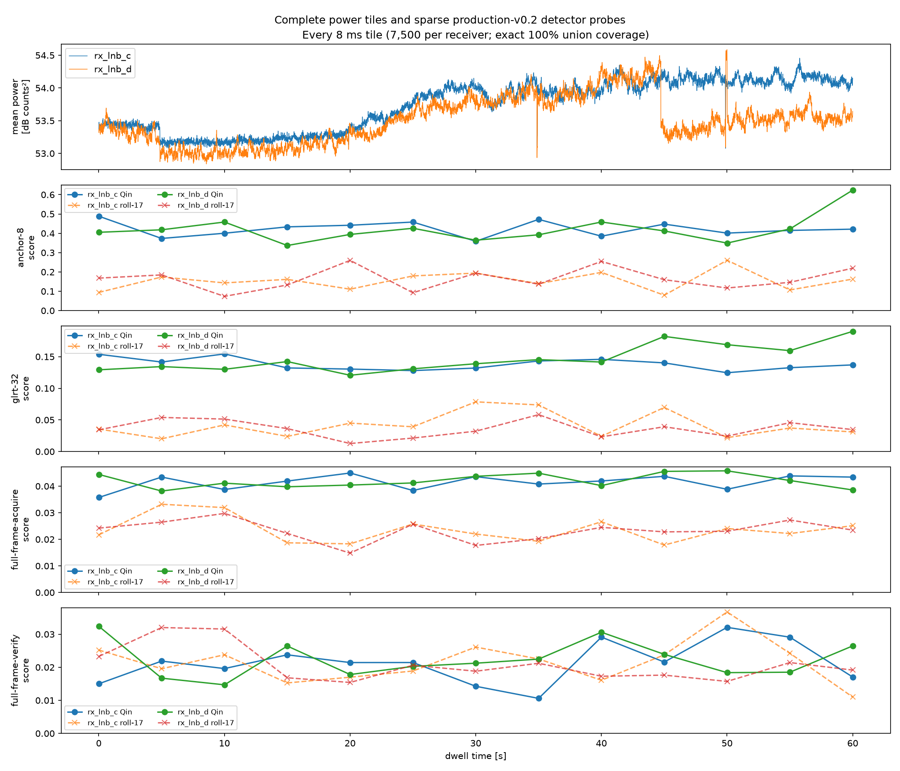
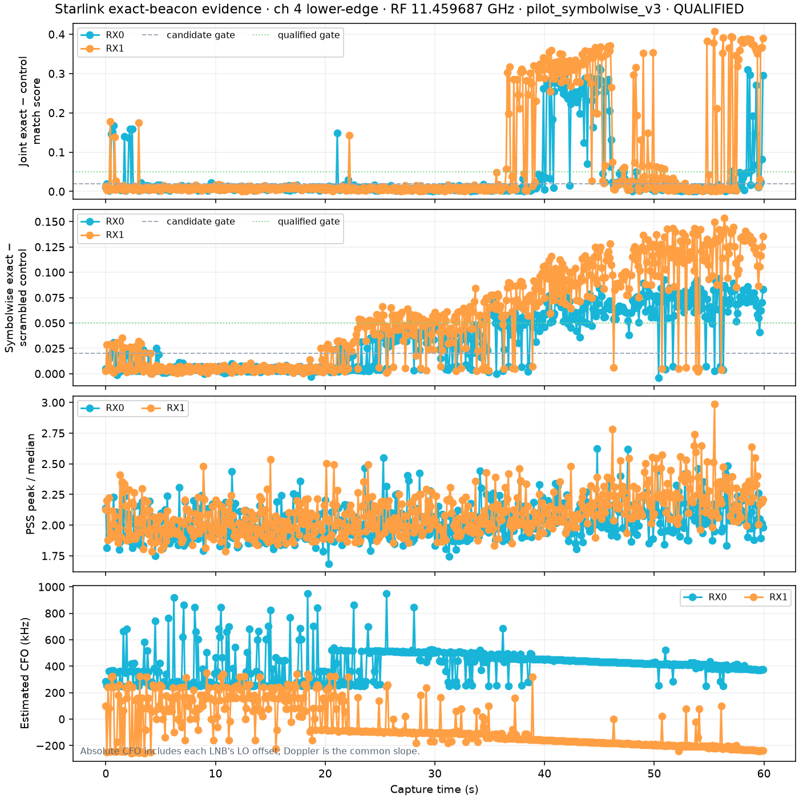
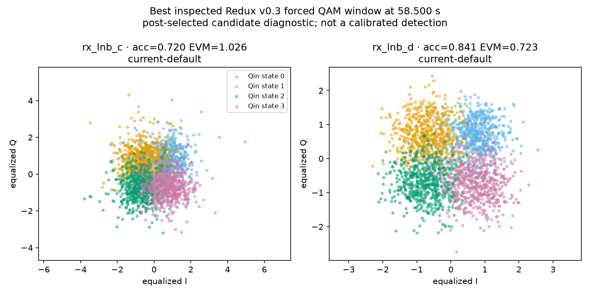
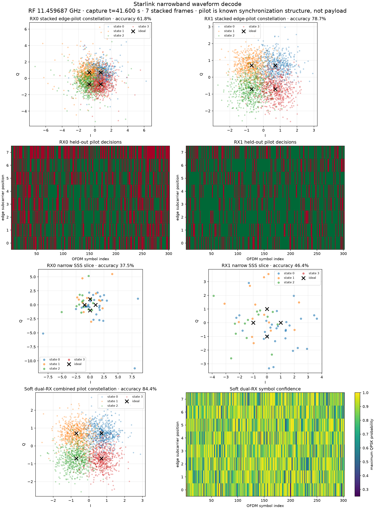
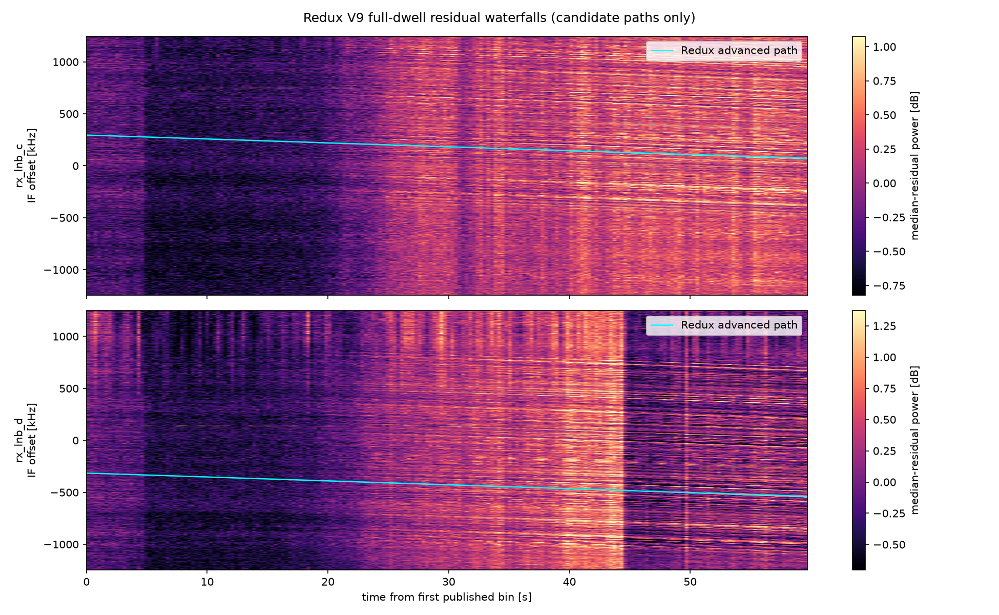

# Signal investigation: `rec_01M09J1R6E59GCC8ANJVYVRN1B`

Investigated 2026-08-18 UTC against Redux numerical source commit
`e66bf9cb4399dc1d2180cf5a819e5c16f6a62de5` and historical
`leo-tracker` oracle commit `0bb80d14759fd8496b74e7d3219a690be18565a6`.
The live recording and analysis services were read only throughout.

## Finding

This dwell contains strong, internally consistent CH4 lower-edge pilot
evidence from about 38 to 60 seconds. At 58.5 s, the known-pilot QPSK
constellations have individual-receiver accuracies of 72.0% and 84.1%, and
inverse-noise dual-RX combining reaches 89.3% versus the 25% random-symbol
baseline. On that directly comparable descriptive metric, it is at least as
strong as the retained RETRO positive's 88.3% combined accuracy. The two
receivers also trace the same Doppler slope:
-4,012 and -3,990 Hz/s with 0.99972 correlation.

This is still **candidate evidence, not a calibrated Redux detection**. The
current live V9 receipt says `candidate_only=true` and
`calibrated_detection_count=null`. The historical oracle's `qualified` flag is
its own heuristic decision, not a Redux false-alarm-calibrated claim.

Two current analysis defects hide the result:

1. Pluto `19f2`'s LNB C is offset from LNB D by about +602.9 kHz. The
   QAM-validated LNB C CFO lies above the current v0.3 +400 kHz boundary for
   75/93 (80.6%) paired candidate windows and 7/9 (77.8%) historically
   qualified windows.
2. Live Redux advanced Doppler follows a parallel ridge about 301--306 kHz
   below the QAM-validated pilot. Its slope is plausible, but its intercept is
   wrong.

## Immutable source and provenance

The dashboard page is
[`rec_01M09J1R6E59GCC8ANJVYVRN1B`](http://gauss:8090/recordings/rec_01M09J1R6E59GCC8ANJVYVRN1B).
The catalog and CAS objects resolve to:

| Field | Value |
|---|---|
| Recording | `rec_01M09J1R6E59GCC8ANJVYVRN1B` |
| Radio / serial | `radio_pluto_19f2` / `10400056f695001322002d0010ad1719f2` |
| Segment | `seg_plan_focused_loop_00000001_18cccbd3289eb706_b_ch4_lower` |
| Receiver order | `rx_lnb_c`, `rx_lnb_d` |
| Edge / channel | CH4 lower edge |
| IF / RF center | 1,709,687,500 / 11,459,687,500 Hz |
| Sampling | 2.5 MS/s, CI16 little-endian, `(sample, receiver, component)` |
| Extent | 150,000,000 samples/RX = 60.000 s |
| Capture interval | `1787027316948559690`--`1787027377155644261` UTC ns |
| IQ object | SHA-256 `23cceb3a5223180ff92398214125513d4c32cc541ec1ae5b7c4c28fba5bbcc8c`, 1,200,000,000 bytes |
| Metadata object | SHA-256 `87c85ff367a29685c4e679112e13680831c51ff40d628e77348c82211eb6ad2c`, 1,642,210 bytes |
| Manifest | SHA-256 `94d96f82a64dfe67704f9c64e9b98c55c7ff128ac731f1260ff39fcc3f7c26be` |
| Recording identity | SHA-256 `cedc0a9083495717048254249a3fe1569c879fe8f8f624d2ac12aceaddd53c69` |

Both CAS files were independently streamed through SHA-256 and their lengths
were checked before analysis. Metadata contains 1,500 contiguous 100,000-sample
refills, one stream ID, and zero gaps. Gain was 44 dB on LNB C and 43--44 dB on
LNB D. The raw metadata `rssi_db_end` field was retained as provenance but is
not interpreted as calibrated RF power.

## Honest window and coverage accounting

"Spans the dwell" and "reads every sample" are different claims. This report
keeps them separate:

| Path | Window / cadence | Windows per RX | Exact union per RX | Coverage | Selection |
|---|---:|---:|---:|---:|---|
| Mean IQ power | 8 ms / contiguous | 7,500 | 60.000 s | 100.000% | none |
| Redux V9 residual waterfall | 32,768 samples / contiguous complete FFT frames | 4,577 | 59.9916544 s | 99.9861% | 20,864-sample tail discarded |
| Historical dense pilot oracle | 10 ms / 100 ms | 600 | 6.000 s | 10.000% | predeclared uniform cadence from 0.0 through 59.9 s |
| Redux production-v0.2 response diagnostic | 8 ms / 5 s plus endpoint | 13 | 0.104 s | 0.1733% | predeclared cadence |
| Redux v0.3 acquisition/QAM diagnostic | 10 ms | 3 | 0.030 s | 0.0500% | post-selected by paired historical score |

The full power curve and V9 waterfall therefore cover essentially the whole
dwell. The expensive pilot searches cover the full 60 s *wall-time range* at a
bounded cadence, not all IQ samples. The three v0.3/QAM checks are deliberately
post-selected and cannot be used to estimate occupancy or false-alarm rate.



The broadband level changes near 23 s, while LNB D changes again near 45 s.
The production-v0.2 Anchor-8 and GLRT scores are elevated even outside the
validated interval; their roll-17 curves are conditioned controls, not an
independent signal-absent null. Those sparse curves alone do not establish a
detection.

## Historical detector: center calibration is decisive

The historical calibration artifact at
`/mnt/qnap01/mouse9911/leo/reports/lnb-calibration.json` (SHA-256
`141a489a08f236839cd1cbec8d31cc31611abd5941b91bca7269974b53d17f8d`)
records this radio's LNB C-minus-D mismatch as +602,869.4 Hz from 1,641
samples (p10 +433,030.7; p90 +607,376.5 Hz). Its source file under
`/mnt/qnap01` was read only. Historical numerical source files were unmodified;
unrelated local changes in `leo-tracker` were limited to tests and `uv.lock`.

Two otherwise identical 600-check oracle runs give:

| Oracle profile | RX center offsets | Dual candidates | Dual qualified | Single-RX candidates / qualified | Track |
|---|---:|---:|---:|---:|---|
| Zero-centered | `0, 0` Hz | 0 | 0 | 154 / 61 | unavailable |
| LNB-calibrated | `+602869.4, 0` Hz | 93 | 9 | 243 / 78 | qualified, 93 points, 38.0--59.9 s |

The historical paired-candidate gates were match margin >=0.02, symbolwise
margin >=0.02, and inter-RX epoch difference <=20 samples. Its stronger
`qualified` gates were both margins >=0.05, coherence >=0.05, and epoch
difference <=8 samples. Single-RX gates were match margin >=0.025 and
symbolwise margin >=0.03. These are the actual recorded oracle parameters, not
thresholds newly fitted to this dwell.



The corresponding
[zero-centered plot](rec_01M09J1R6E59GCC8ANJVYVRN1B_assets/leo_tracker_uncalibrated_dense.png)
shows why LNB D-only evidence never becomes a paired track.

The calibrated CFO ranges over paired candidates are +372.7 to +459.3 kHz on
LNB C and -238.2 to -151.5 kHz on LNB D. Their difference is about 612 kHz in
the strong interval, consistent with the retained receiver mismatch. The
common slopes are -4,012.0 and -3,989.9 Hz/s; their difference is 22.2 Hz/s and
frequency correlation is 0.9997168. The historical gate was correlation >=0.8,
slope difference <=500 Hz/s, and absolute slope <=15 kHz/s.

The sharp response rise and smooth dual-RX CFO trajectories are much more
specific than the broadband power change. Sporadic early score spikes and CFO
aliases remain visible, which is why an isolated high score is insufficient.

## Boundary clipping and current Redux acquisition

The immutable v0.3 contract currently requires an absolute CFO domain covering
at least -400 through +400 kHz; deployed receiver profiles use exactly that
domain. The following Redux checks use the same 10 ms IQ on the three strongest
paired historical windows:

| Time | LNB | QAM/oracle CFO | Current v0.3 winner | Current accuracy / EVM | Widened diagnostic winner | Diagnostic accuracy / EVM |
|---:|---|---:|---:|---:|---:|---:|
| 41.6 s | C | +446.6 kHz | +217.7 kHz | 25.7% / 24.970 | +446.6 kHz | 61.8% / 1.447 |
| 41.6 s | D | -165.4 kHz | -165.3 kHz | 78.7% / 0.846 | same | same |
| 45.0 s | C | +433.2 kHz | +320.0 kHz | 24.7% / 15.890 | +433.1 kHz | 31.5% / 8.411 |
| 45.0 s | D | -178.7 kHz | -178.7 kHz | 79.2% / 0.818 | same | same |
| 58.5 s | C | +379.2 kHz | +379.2 kHz | 72.0% / 1.026 | same | same |
| 58.5 s | D | -232.9 kHz | -232.9 kHz | 84.1% / 0.723 | same | same |

The widened LNB-C run searched the union `[-400 kHz, +1.04 MHz]` only as a
recoverability diagnostic. It incurs a larger look-elsewhere space and has no
calibrated threshold; it is **not** a proposed v0.3 runtime profile. At 41.6 s,
the current search chooses a noise-like LNB-C basin, while the diagnostic
recovers the oracle epoch/CFO and a separated constellation. At 45.0 s it
recovers the right acquisition peak, but LNB-C's QAM is intrinsically poor in
that particular 10 ms window; held-out acquisition score and QAM compactness
must remain separate evidence.

At 58.5 s the signal has drifted inside the existing +400 kHz edge, so the
unmodified v0.3 search finds both receivers:



## QAM comparison with zero-centered replay and RETRO

Historical decoding was replayed at one qualified boundary-clipped window
(41.6 s) and one strongest-QAM in-bound window (58.5 s). Each result stacks
seven complete frames when calibrated; each frame has 300 known pilot symbols
on eight edge subcarriers. These are predictable synchronization symbols, not
decoded user payload.

| Time / profile | Dual candidate / qualified | LNB C accuracy / EVM | LNB D accuracy / EVM | Soft dual-RX accuracy / EVM |
|---|---|---:|---:|---:|
| 41.6 s, zero-centered | no / no | 25.1% / 22.500 | 78.7% / 0.846 | 78.5% / 0.845 |
| 41.6 s, calibrated | yes / yes | 61.8% / 1.447 | 78.7% / 0.846 | 84.4% / 0.743 |
| 58.5 s, zero-centered | no / no | 26.0% / 25.725 | 84.1% / 0.723 | 83.8% / 0.723 |
| 58.5 s, calibrated | yes / no | 72.0% / 1.026 | 84.1% / 0.723 | **89.3% / 0.623** |
| Retained RETRO positive | candidate-only canary | 74.8% / 0.943 | 79.9% / 0.783 | **88.3% / 0.638** |

The uncalibrated dual combiner remains superficially good because inverse-noise
weighting almost discards the chance-level LNB C result. That is not equivalent
to dual-receiver acquisition: zero-centered replay has no paired candidates,
no qualified checks, and no dual-RX Doppler track. Per-receiver acquisition and
QAM must be shown alongside any combined number.



The retained RETRO canary receipt was green (`metrics_match_oracle=true`) with
SHA-256 `33f829b87302391fc4e1032b90c20c8bf0a584873654518a5dfc84e6c866ab91`.
Like this dwell, the receipt remains `candidate_only=true` with no calibrated
detection decision.

## Doppler and waterfall

Live Redux V9 analyzes 4,577 complete FFT frames per receiver and reports no
basic candidates. Its advanced-path-only evidence reports -3,750 Hz/s on both
receivers, with held-out scores 0.500 (C) and 0.763 (D), substantially above
the stationary and opposite-slope controls. The common slope is close to the
pilot's approximately -4 kHz/s slope, but the selected ridge is not the pilot:

| Time | LNB C V9 minus pilot | LNB D V9 minus pilot |
|---:|---:|---:|
| 41.6 s | -306.5 kHz | -304.9 kHz |
| 45.0 s | -305.8 kHz | -304.3 kHz |
| 58.5 s | -302.5 kHz | -300.8 kHz |



The image contains multiple sloped and stationary structures plus broad level
changes. A sloping feature is visually present, but appearance alone cannot
tell which ridge carries the known pilot. The cyan V9 path overlays the wrong
parallel ridge. Known-symbol acquisition/QAM supplies the missing association.

## Recommended center and guard design

Do not silently reinterpret or shift published v0.3 bounds. There are two safe
additive designs:

1. **Preferred: a versioned v0.4 center-plus-residual contract.** Persist an
   immutable `receiver_frequency_calibration_id` and center per receiver, then
   search the same residual domain for Qin and every surrogate. For this radio,
   LNB C center is +602,869.4 Hz and LNB D center is 0 Hz; a +/-400 kHz residual
   domain corresponds to absolute `[+202869.4, +1002869.4]` Hz for C and
   `[-400000, +400000]` Hz for D. Recalibrate the maximum statistic over the
   versioned search size.
2. **Alternative: immutable preprocessing calibration identity.** Frequency-
   shift each receiver to a shared reference before unchanged v0.3 acquisition.
   The shift, estimator revision, source artifact digest, uncertainty, and
   transformed-IQ digest must be immutable provenance. Qin and controls must
   receive exactly the same transformed samples.

The minimum regression matrix should be explicit rather than based only on
this successful dwell:

| Dimension | Required cases |
|---|---|
| Receiver center | C `+602869.4` Hz; D `0` Hz |
| Residual CFO inside guard | `-400000, -399500, -350000, 0, +350000, +399500, +400000` Hz |
| Just outside guard | `-400500, +400500` Hz, with explicit reject/edge policy |
| Absolute C CFO implied by inside cases | `+202869.4, +203369.4, +252869.4, +602869.4, +952869.4, +1002369.4, +1002869.4` Hz |
| Absolute D CFO implied by inside cases | same as residual CFO |
| Epoch modulo 64 | all 64 residues; mandatory spot labels `0, 1, 31, 32, 63` |
| Signal class | clean injection, operational-SNR injection, Qin-free random CI16 null, and precommitted symbol surrogates |
| Assertions | recovered epoch/CFO, held-out margin, per-RX QAM, dual-RX CFO-difference coherence, correct boundary behavior, and family-wise false-alarm calibration |

The p10/p90 spread in the old calibration is large (174.3 kHz), so production
must define whether the center is a stable hardware calibration, a per-dwell
nuisance estimate, or both. If it is re-estimated from the same dwell, that
estimation is part of the search and its look-elsewhere cost belongs in the
null calibration.

For Doppler, associate candidate ridges to pilot CFO points and dual-RX
frequency-difference coherence before publishing a pilot track. A visually
strong slope with a 300 kHz intercept error should remain `advanced-path-only`.

## Reproduction

The report driver is
[`rec_01M09J1R6E59GCC8ANJVYVRN1B_analysis.py`](rec_01M09J1R6E59GCC8ANJVYVRN1B_analysis.py).
It verifies the immutable objects before reading them. The historical tool was
fed through a temporary `leo-tracker.beacon-iq/v1` manifest and a symlink to the
verified CAS object; Redux never imports `leo-tracker`. The exact wrapper
manifest is retained as
[`leo_tracker_oracle_manifest.json`](rec_01M09J1R6E59GCC8ANJVYVRN1B_assets/leo_tracker_oracle_manifest.json).
To construct it without copying the 1.2 GB IQ object, copy that manifest to
`/tmp/j1-oracle-capture/manifest.json` and symlink the verified IQ CAS object as
`/tmp/j1-oracle-capture/recording.ci16`.

Dense historical runs:

```bash
OPENBLAS_NUM_THREADS=1 OMP_NUM_THREADS=1 MKL_NUM_THREADS=1 nice -n 19 \
  ~/gits/leo-tracker/.venv/bin/leo-radio starlink-beacon-analyze \
  /tmp/j1-oracle-capture /tmp/j1-analysis/leo_tracker_dense.json \
  --window-s 1 --maximum-analysis-rate-hz 50000 \
  --exact-interval-s .1 --exact-window-s .01 \
  --exact-acquisition-method pilot_symbolwise_v3 \
  --exact-subband-rate-hz 2500000 \
  --receiver-center-offsets-hz 0 0 \
  --plot /tmp/j1-analysis/leo_tracker_dense.png

OPENBLAS_NUM_THREADS=1 OMP_NUM_THREADS=1 MKL_NUM_THREADS=1 nice -n 19 \
  ~/gits/leo-tracker/.venv/bin/leo-radio starlink-beacon-analyze \
  /tmp/j1-oracle-capture /tmp/j1-analysis/leo_tracker_calibrated_dense.json \
  --window-s 1 --maximum-analysis-rate-hz 50000 \
  --exact-interval-s .1 --exact-window-s .01 \
  --exact-acquisition-method pilot_symbolwise_v3 \
  --exact-subband-rate-hz 2500000 \
  --receiver-center-offsets-hz 602869.4 0 \
  --plot /tmp/j1-analysis/leo_tracker_calibrated_dense.png
```

The output JSON hashes were respectively
`15952bb559d6ceea4af12cf9b4b1da4e3bbf0fa94ab1488537bcea0381a7a85b`
and `8e0ae4e6ae83ac041847fc4fc458832e954f1c8bdbaf961ba1295b50c02a46bd`.

Historical decode example (use `41.6` in place of `58.5` for the other retained
window):

```bash
OPENBLAS_NUM_THREADS=1 OMP_NUM_THREADS=1 MKL_NUM_THREADS=1 nice -n 19 \
  ~/gits/leo-tracker/.venv/bin/leo-radio starlink-beacon-decode \
  /tmp/j1-oracle-capture \
  <(jq '{checks:.exact_checks}' /tmp/j1-analysis/leo_tracker_calibrated_dense.json) \
  /tmp/j1-analysis/leo_tracker_decode_58p5.json --time-s 58.5 \
  --plot /tmp/j1-analysis/leo_tracker_qam_58p5.png \
  --symbols /tmp/j1-analysis/leo_tracker_qam_58p5.npz
```

Redux report run:

```bash
PYTHONPATH=src OPENBLAS_NUM_THREADS=1 OMP_NUM_THREADS=1 MKL_NUM_THREADS=1 \
  nice -n 19 ~/gits/leo-tracker/.venv/bin/python \
  reports/rec_01M09J1R6E59GCC8ANJVYVRN1B_analysis.py \
  --iq ~/.local/share/leo-flow/objects/sha256/23/23cceb3a5223180ff92398214125513d4c32cc541ec1ae5b7c4c28fba5bbcc8c \
  --metadata ~/.local/share/leo-flow/objects/sha256/87/87c85ff367a29685c4e679112e13680831c51ff40d628e77348c82211eb6ad2c \
  --oracle-report /tmp/j1-analysis/leo_tracker_calibrated_dense.json \
  --uncalibrated-oracle-report /tmp/j1-analysis/leo_tracker_dense.json \
  --retro-receipt ~/.local/state/leo-flow/starlink-retro-qam-canary/latest.receipt.json \
  --output-directory reports/rec_01M09J1R6E59GCC8ANJVYVRN1B_assets \
  --git-commit e66bf9cb4399dc1d2180cf5a819e5c16f6a62de5
```

Machine-readable bounded results are in
[`results.json`](rec_01M09J1R6E59GCC8ANJVYVRN1B_assets/results.json).
Historical decode JSON is retained for calibrated and zero-centered checks at
[41.6](rec_01M09J1R6E59GCC8ANJVYVRN1B_assets/leo_tracker_decode_41p6.json)
and
[58.5 s](rec_01M09J1R6E59GCC8ANJVYVRN1B_assets/leo_tracker_decode_58p5.json),
plus the respective zero-centered
[41.6](rec_01M09J1R6E59GCC8ANJVYVRN1B_assets/leo_tracker_uncalibrated_decode_41p6.json)
and
[58.5 s](rec_01M09J1R6E59GCC8ANJVYVRN1B_assets/leo_tracker_uncalibrated_decode_58p5.json)
controls. The NPZ symbol archives were deliberately not committed; they are
reproducible from the immutable IQ and decode commands.

## Limitations

- The report does not derive a false-alarm probability or claim calibrated
  detection.
- The dense historical scan samples 10%, not 100%, of IQ time.
- Selected v0.3/QAM windows are post-selected on the same dwell.
- Roll-17 is a conditioned control and does not replace independent Qin-free
  null recordings.
- Narrow 2.5 MHz capture contains one edge-pilot neighborhood, not the complete
  240 MHz Starlink channel; SSS is only an eight-subcarrier narrow slice.
- No Starlink header or user payload was decoded.
