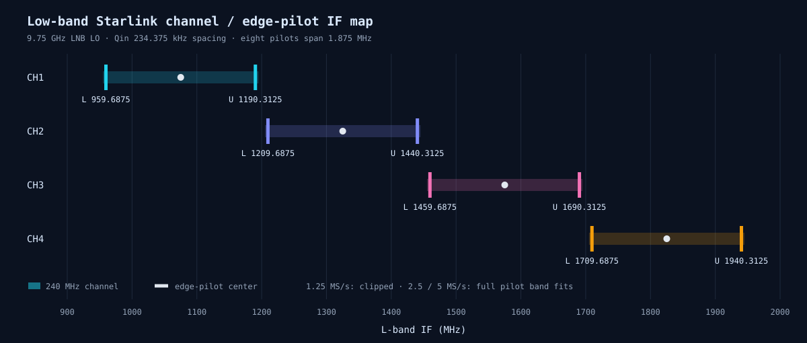
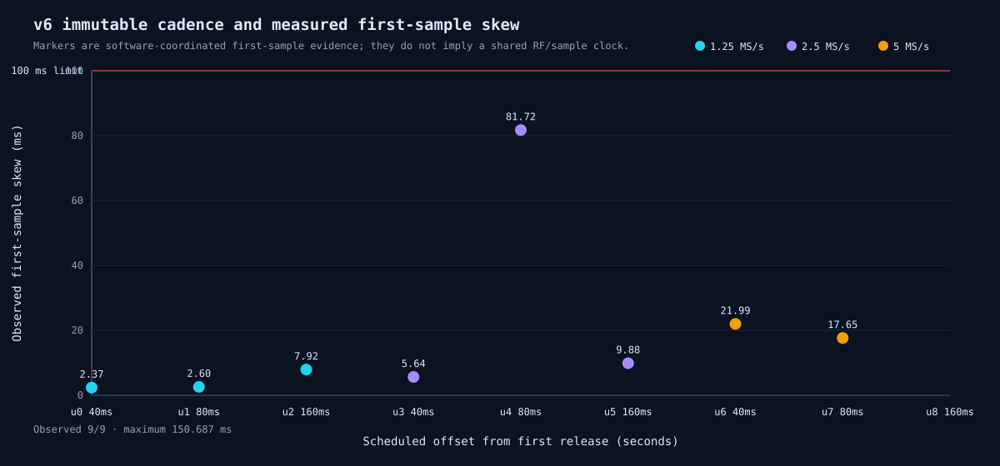
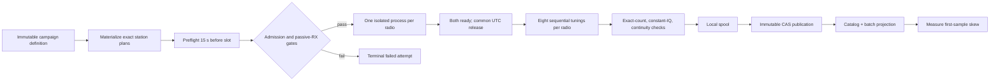
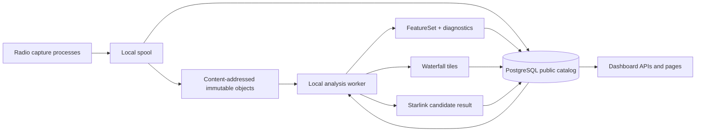
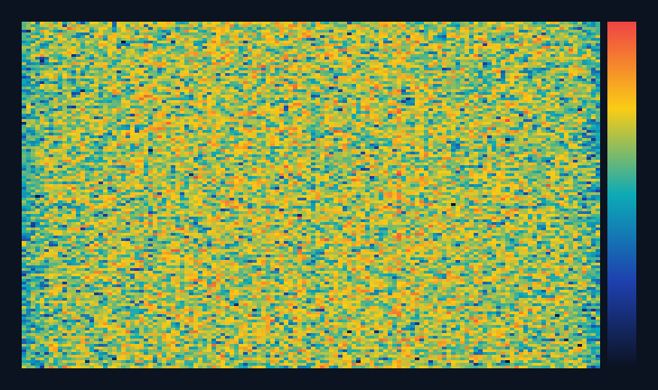
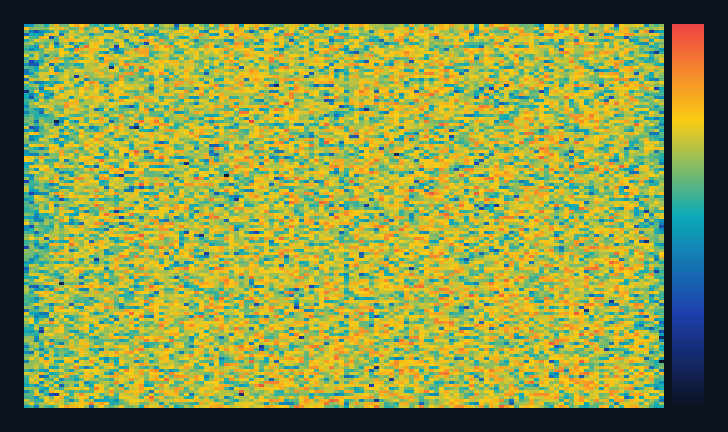

# Dual-radio scan, capture, analysis, and dashboard flow

This note is the operator-facing map for the `.20`/`.21` v5 path on Gauss. It
audits the frozen `qual_gauss_r20_r21_20260816_v6` qualification against the
Qin/`leo-tracker` frequency model and explains the production boundary between
capture and local analysis. `leo-tracker` was used only as a numerical oracle;
it is not a runtime dependency.

## Bottom line

The frozen v6 station definitions use the correct four Starlink Ku downlink
channels, lower/upper edge-pilot centers, 9.75 GHz LNB conversion, and passive
RX settings. `.20` and `.21` each capture eight tunings per recording in the
same alternating order. The two radio processes share a requested UTC release,
but synchronization is **measured software coordination**, not a hardware clock
or trigger. Actual first-sample skew is recorded and must remain below 100 ms.

Two interpretation limits are material:

1. v6 uses the same edge order on both radios in each cell. It qualifies
   same-edge cross-radio repeatability, but does not provide simultaneous
   lower-edge/upper-edge diversity. Add explicit opposite-edge cells if that
   geometry from the reference report is required.
2. 1.25 MS/s captures only 1.25 MHz of a 1.875 MHz pilot band. Those recordings
   are deliberately marked `allow_clipped`; do not pool them with the complete
   2.5 or 5 MS/s observations or treat them as full-pilot detections.

No calibrated Starlink detection count is claimed here. Power, PSD peaks,
waterfalls, and candidate scores are descriptive evidence. A detection claim
requires a frozen calibration identity and accepted operating point.

## Radios and receive chains

| Address | Radio identity | Pluto serial suffix | Receive chains | Role |
|---|---|---:|---|---|
| `192.168.1.20` | `radio_pluto_5d4d` | `5d4d` | `rx_lnb_a`, `rx_lnb_b` | radio A, passive RX |
| `192.168.1.21` | `radio_pluto_19f2` | `19f2` | `rx_lnb_c`, `rx_lnb_d` | radio B, passive RX |

Both station contracts require standard libiio IP transport, two RX channels,
the `I0,Q0,I1,Q1` component layout, all four scan-mask bits, both TX hardware
gains at or below -80 dB, and every DDS scale at zero. A failure is terminal for
that attempt; capture must never silently proceed with an unexpected identity,
layout, transport, or active transmitter.

## Qin channel and edge-pilot geometry

The model uses 240 MHz channels on a 250 MHz grid, 234.375 kHz OFDM spacing,
lower pilot indices 528–535, upper pilot indices 488–495, and a 1.875 MHz pilot
band. The LNB local oscillator is 9.75 GHz.

| Channel | RF center (GHz) | Lower RF / IF center (GHz / MHz) | Upper RF / IF center (GHz / MHz) |
|---:|---:|---:|---:|
| 1 | 10.825 | 10.7096875 / 959.6875 | 10.9403125 / 1190.3125 |
| 2 | 11.075 | 10.9596875 / 1209.6875 | 11.1903125 / 1440.3125 |
| 3 | 11.325 | 11.2096875 / 1459.6875 | 11.4403125 / 1690.3125 |
| 4 | 11.575 | 11.4596875 / 1709.6875 | 11.6903125 / 1940.3125 |

Relative to each RF channel center, the lower pilot center is
−115.4296875 MHz and the upper pilot center is +115.1953125 MHz. Some actual
Pluto LO readbacks are 2 Hz below a requested lower-edge center; this is exposed
in recording metadata and is harmless tuning quantization, not a channel-map
mismatch.



## Scan order

Every recording contains the same eight-tuning sequence on both radios. `L`
and `U` refer to the edge visited first within each channel, not radio polarity.

| Order | Segment sequence |
|---|---|
| `L` | C1 lower, C1 upper, C2 lower, C2 upper, C3 lower, C3 upper, C4 lower, C4 upper |
| `U` | C1 upper, C1 lower, C2 upper, C2 lower, C3 upper, C3 lower, C4 upper, C4 lower |

The order alternates `L, U, L, U, ...` between qualification cells, but a cell
assigns the same order to `.20` and `.21`. This avoids a systematic first/last
edge bias while preserving same-edge replication. It does not create
opposite-edge simultaneity.

## v6 sample-rate and duration matrix

Each cell creates one eight-segment recording per radio. Raw byte estimates
assume two receivers × complex int16 (`I0,Q0,I1,Q1`), excluding metadata,
content-store overhead, and derived products.

| Unit | Rate (MS/s) | Duration per tuning (ms) | Samples per tuning | Pilot coverage | Pair raw bytes |
|---:|---:|---:|---:|---|---:|
| u000 | 1.25 | 40 | 50,000 | clipped; 625 kHz missing | 6.4 MB |
| u001 | 1.25 | 80 | 100,000 | clipped; 625 kHz missing | 12.8 MB |
| u002 | 1.25 | 160 | 200,000 | clipped; 625 kHz missing | 25.6 MB |
| u003 | 2.5 | 40 | 100,000 | complete; 312.5 kHz guard | 12.8 MB |
| u004 | 2.5 | 80 | 200,000 | complete; 312.5 kHz guard | 25.6 MB |
| u005 | 2.5 | 160 | 400,000 | complete; 312.5 kHz guard | 51.2 MB |
| u006 | 5.0 | 40 | 200,000 | complete; 1.5625 MHz guard | 25.6 MB |
| u007 | 5.0 | 80 | 400,000 | complete; 1.5625 MHz guard | 51.2 MB |
| u008 | 5.0 | 160 | 800,000 | complete; 1.5625 MHz guard | 102.4 MB |

The full 18-recording grid is 313.6 MB of raw sample payload. The immutable
schedule begins at `1786909469102474538` UTC ns, advances on the exact rational
period `400000000000 / 3` ns (about 133.333 s), allows 15 s for preflight, and
rejects a start more than 5 s late. It never compresses missed slots into a
catch-up burst.

The run acquired all 18 recordings, but the qualification itself correctly
ended `terminal_failed`: u008 measured 150,686,531 ns cross-radio first-sample
skew, exceeding the 100,000,000 ns limit. The samples are valid published
recordings; the pair is not coordination-qualified and its per-cell analysis
was not invoked. Thus the honest summary is **8/9 eligible coordinated cells,
18/18 recordings acquired, 16/18 analyzed in this run**—not a 9/9 pass.
The terminal audit also records `starlink_campaign_wired: false`: this v6 run
proved capture, ordinary FeatureSet analysis, waterfall production, storage,
and dashboard projection, but did not run the Starlink candidate pipeline.



## Capture mechanism



This is a bounded scheduled invocation, not an unbounded callback queue and not
a loop that repeatedly calls an opaque capture function. The campaign state
machine materializes each immutable unit, starts one OS process per radio,
records readiness, releases both toward a common requested UTC instant, and
persists each attempt independently. A single-radio run uses the same station
capture primitive with one process; coordinated dual capture wraps two such
processes and adds common-release and observed-skew semantics.

The critical gates are identity and firmware/runtime provenance, transport and
metadata capability, passive TX/DDS state, exact RX layout, storage capacity,
catalog readiness, process-mode ownership, constant-IQ rejection on all four
components, sample-count completeness, segment continuity, and measured
first-sample skew. Passing the 100 ms bound is acceptance, not proof of hardware
synchronization; an unusually large accepted value should still be investigated.

## Storage and local analysis boundary



Capture owns acquisition, integrity checks, spool publication, immutable sample
objects, and catalog identity. Analysis is a separate local worker and consumes
only public recording/catalog contracts; it must not construct spool or CAS
paths or import capture-private models. It writes immutable derived artifacts
and public projection receipts. The dashboard reads those projections, so a
recording row and detail page can exist before every derived result is ready and
update as FeatureSet, waterfall, and Starlink analysis complete.

The finite v6 qualification explicitly runs analysis after each completed
capture cell to prove the whole vertical path. For the main acquisition regime,
capture and analysis remain separate operational phases/processes. If analysis
is allowed to drain while scanning continues, resource limits and admission
policy must ensure it cannot perturb radio capture; otherwise capture first and
run the analysis drain afterward.

## Starlink analysis semantics

| Product | What it establishes | What it does **not** establish |
|---|---|---|
| Sample-quality metrics | non-constant, plausible digitized input and magnitude diagnostics | Starlink identity |
| Compact PSD | spectral shape and peak-to-median contrast | a calibrated pilot detection |
| Waterfall | time/frequency power structure for operator inspection | transmitter identity by itself |
| Qin-aware candidate suite | known pilot geometry, conditioned correlation/roll controls, candidate score and provenance | accepted detection without calibration |
| Calibrated decision | candidate evaluated under a frozen calibration identity and operating point | generalization beyond that calibration domain |

Clipped 1.25 MS/s inputs must carry their limitation into the candidate result.
Candidate outputs without applicable calibration are displayed as **Not
evaluated**, not silently converted to zero detections. A missing Starlink result
for an older recording is likewise truthful `404`/Not evaluated rather than a
server error or an inferred negative.

## Qualification recordings

The reproducible evidence file is the canonical machine-readable inventory:
[`v6-public-evidence.json`](reports/scan-capture-v6/assets/v6-public-evidence.json).
It contains recording IDs, requested and observed starts, capture/analysis
states, observed skew, and representative public waterfall/Starlink projection
status. The final renderer check requires all 9 terminal batches and 18
successful recordings; that completeness check does not override the failed
skew gate.

| Unit | Skew (ms) | Pair result | `.20` recording / analysis | `.21` recording / analysis |
|---:|---:|---|---|---|
| u000 | 2.367 | eligible | `rec_01M061NADM22WM5CGFR1RWZ9S4` / complete | `rec_01M061NADTH1QMKAEDKQDZ0YTP` / complete |
| u001 | 2.595 | eligible | `rec_01M061SCMAJV5RE6493M360TZB` / complete | `rec_01M061SCMGF2BMCQH7H3DSYP7R` / complete |
| u002 | 7.920 | eligible | `rec_01M061XETZ00T4XYBX488A07HZ` / complete | `rec_01M061XEV56ZHFSW81NW2MADFF` / complete |
| u003 | 5.644 | eligible | `rec_01M0621H1MAWBHX7PR2GPF5BWB` / complete | `rec_01M0621H1XZ9RBXMBYW4V8K5Y4` / complete |
| u004 | 81.720 | eligible, conspicuous | `rec_01M0625K8AGQZ1XNPV0D98JNRM` / complete | `rec_01M0625K8GZNYC30CMNS0BJWFA` / complete |
| u005 | 9.880 | eligible | `rec_01M0629NEX3CWV5H5N9177ZZR5` / complete | `rec_01M0629NF9C9DEDHYDG1ZAKDX7` / complete |
| u006 | 21.990 | eligible | `rec_01M062DQNKJM4Y0F0463PFX4R1` / complete | `rec_01M062DQNYEZX44DAC7MXX86MY` / complete |
| u007 | 17.653 | eligible | `rec_01M062HSW5C6J690DEMT769P7G` / complete | `rec_01M062HSWKQ3Y0D9V4ND6V548G` / complete |
| u008 | **150.687** | **ineligible: skew limit** | `rec_01M062NW2Z8NN7H24P1AMT9CBP` / pending | `rec_01M062NW364BHV3WXKMFE54GS3` / pending |

The two u008 `pending` states mean “not run after the failed coordination gate,”
not capture loss and not a negative scientific result. They may be analyzed
later as individual recordings, but must never be relabeled as an eligible
coordinated pair.

Representative complete-pilot waterfalls are rendered from public dashboard
tiles only:

| `.20` (`radio_pluto_5d4d`) | `.21` (`radio_pluto_19f2`) |
|---|---|
|  |  |

These plots are descriptive signal-power views. Bright structure is not labeled
as Starlink unless the calibrated decision contract says so.

## Reproduce and verify

From the repository root:

```bash
.venv/bin/python reports/scan-capture-v6/render_scan_capture.py \
  --refresh-api \
  --require-terminal
.venv/bin/ruff check reports/scan-capture-v6/render_scan_capture.py
```

The renderer is standard-library Python. It reads the frozen v6 definition and
materialization only to audit their declared plan, and reads results only from
public dashboard APIs. It never opens a radio context, campaign database, CAS
object, or private component storage. Generated compact source JSON makes the
waterfall PNGs reproducible without retaining a private storage dependency.

## Audit provenance

- Frozen v6 definition SHA-256:
  `e2d0bd04a569d0d0aa47dbd4da1e6a3bbefe29e3d15507c415ddd204e7144b37`
- Frozen v6 materialization SHA-256:
  `24a3bcaf456511c82304ffcbab450431e56dcdce544aa91fd9012376edf04030`
- Frozen/current `scan_plan.py` SHA-256:
  `d9908046d3400109d1dc0a2ca174cea8f6f56ccded9df4d1914a34c22a35fbb1`
- Terminal v6 audit SHA-256:
  `465a1a28ac221e8c802cca9eafb17f738df4ac65236078c2148b588b1d3b1ff7`
- Redux fixture: `docs/experiments/starlink-edge-pilot-if-fixture.md`
- Numerical oracle: `~/gits/leo-tracker/src/leo_tracker/radio/beacon/channels.py`
- Reference reports:
  `~/gits/leo-tracker/reports/starlink-detector-evaluation/REPORT.md` and
  `~/gits/leo-tracker/reports/sync-scan-cross-radio-2026-08-14/REPORT.md`
